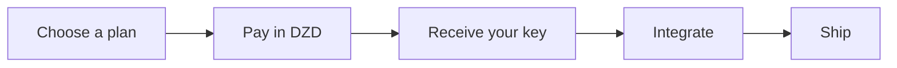

Algerian developers and businesses increasingly need **AI API access**: the ability to send prompts to GPT, Claude, Gemini, or open models from their own applications. Most global AI providers have two problems for Algerian users: foreign-card-only billing and USD pricing.

This guide covers what an AI API is, what it costs when billed in DZD, how to pay without a foreign card, and what to check before choosing a provider.

## What is an AI API?

An AI API (or LLM API) is a programmatic interface to large language models. Instead of typing prompts into a chat website, you send requests from your code:

- A chatbot on your website or WhatsApp
- An automation that summarizes documents
- A pipeline that extracts data from invoices
- A coding agent that edits your repository

You pay per use, traditionally per token (a unit of text). For Algerian teams, that means foreign-currency exposure on every invoice, plus the barrier of needing a card that works internationally.

## The payment problem in Algeria

International providers ([OpenAI](https://openai.com/api/), [Anthropic](https://www.anthropic.com/), [Google](https://ai.google.dev/)) bill in USD with foreign cards. Options for Algerians are limited:

- Virtual cards (Payoneer, etc.): KYC friction, fees, and some still block AI providers
- Cards from relatives abroad: not scalable for a business
- Prepaid international cards: expensive to load and maintain

This is why **local AI providers exist**: they give you the same API access, but bill in Algerian dinars and accept **CCP and Baridi Mob**.

## What an AI API costs in DZD in Algeria

At Hawiyat, AI API access is sold as the Composer execution layer, with transparent monthly caps:

| Plan | Price | What you get |
|------|-------|--------------|
| Pro | 6,000 DA/month | AI API access, model routing, evaluation, caching |
| MAX 5X | 15,000 DA/month | 5x capacity, priority routing |
| MAX 20X | 30,000 DA/month | 20x capacity for teams and heavy pipelines |

No surprise per-token bills in USD. Your monthly cap is fixed in dinars, and the Composer routes each task to the best model **within your plan**. Quality, latency, and cost are balanced automatically.

See the [AI API in Algeria](/ai-api-algeria) page and [full pricing in DZD](/pricing).

## Which models can I access?

A single Hawiyat key gives you access to:

- **GPT** (OpenAI models)
- **Claude** (Anthropic models)
- **Gemini** (Google models)
- **Open models** (open-weight LLMs)

Models are **routes on the execution layer**, not separate subscriptions. If one provider is down or slow, Composer falls back automatically. You never manage multiple keys or vendor dashboards.

## How to get an AI API key in Algeria

1. **Choose a plan.** Start with Pro (6,000 DA/month) on the [pricing page](/pricing).
2. **Pay.** CCP or Baridi Mob, in dinars. No foreign card needed.
3. **Receive your key.** Activation happens right after payment confirmation.
4. **Integrate.** Use the key in your app, workflow, or agent, exactly like any OpenAI-compatible API.

Want the developer angle? See [Claude Code in Algeria](/blog/claude-code-algeria) or the full [AI providers guide](/blog/ai-providers-algeria-how-to-choose).

## What to check before choosing a provider

- **DZD billing.** Is the price fixed in dinars, or pegged to USD?
- **Local payment methods.** CCP and Baridi Mob should be accepted.
- **Local support.** Arabic, French, or English, same timezone.
- **Model access.** One key to multiple models, not a single-vendor lock-in.
- **Transparency.** Per-run evaluation so you know what you paid for.

## Frequently asked questions

**Can I get an AI API in Algeria without a foreign card?** Yes. Providers like Hawiyat accept CCP and Baridi Mob and bill in DZD.

**Is an AI API the same as a ChatGPT subscription?** No. An API is for developers building their own apps; a subscription is for chatting in a website. Hawiyat sells API access (the execution layer), not subscriptions.

**How much does the OpenAI API cost in Algeria?** International pricing is in USD per token. With a local provider, you pay a fixed monthly cap in dinars instead.

**Can I switch models with one key?** Yes. That is the point of a model-agnostic execution layer.

---

*Hawiyat is an independent Algerian AI infrastructure provider. OpenAI, Anthropic, and Google trademarks belong to their respective owners.*
