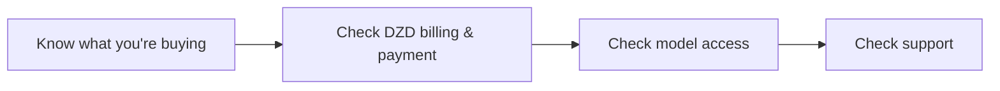

The Algerian AI market is growing, and so is the number of companies offering AI services. But "AI provider" means different things: some sell subscriptions, some sell API keys, some sell project-based services. Choosing wrong means wasted money or a broken pipeline.

Here is a practical framework for choosing an AI provider in Algeria.

## Step 1: Understand what you are buying

| Offering | What it is | Who it's for |
|----------|-----------|--------------|
| **AI API / execution layer** | A key that calls models from your code | Developers, businesses building automations |
| **Subscription access** | Chat access via a website/app | Individuals who want to chat with AI |
| **Agency services** | A team builds AI features for you | Businesses without technical staff |

They are not interchangeable. If you want to *build*, you need an API. If you want to *chat*, a subscription or free tool is enough. If you want someone else to *build it*, you need an agency.

## Step 2: Check the payment reality

This is the filter that eliminates most international options:

- **Billed in DZD?** If pricing is pegged to USD, you carry currency risk.
- **CCP and Baridi Mob accepted?** If not, you need a foreign card.
- **Transparent caps?** Monthly cap in dinars beats per-token USD billing for predictability.

A provider that passes this filter is genuinely local. That is the point of an Algerian AI provider.

## Step 3: Check model access

- **One key, multiple models?** GPT plus Claude plus Gemini plus open models behind a single key is the modern standard (model-agnostic).
- **Fallbacks?** If one model is down, does your workflow keep running?
- **Evaluation?** Do you see quality scores for each run?

Single-vendor lock-in is a red flag. Models change constantly; the layer that routes between them is what lasts.

## Step 4: Check support

- **Language.** Arabic, French, or English, not just English.
- **Timezone.** A team in Algeria, not a ticket system in another timezone.
- **Channel.** WhatsApp support matters in Algeria.

## How Hawiyat fits

Hawiyat is an AI infrastructure platform based in Algeria: the execution layer between frontier AI models and business systems.

- **Product:** API keys (Composer plans) plus managed services (n8n, Evolution API, cloud)
- **Billing:** DZD. Pro 6,000 DA/month, MAX 5X 15,000, MAX 20X 30,000
- **Payment:** CCP, Baridi Mob, USD
- **Models:** GPT, Claude, Gemini, and open models as routes, not subscriptions
- **Support:** Arabic, French, English, via WhatsApp

See [the AI API in Algeria](/ai-api-algeria), [services](/services), and [pricing in DZD](/pricing).

## How to choose, in one pass

Use the four-step framework above, and you will be able to sort any provider in an afternoon. The [AI API cost guide](/blog/ai-api-algeria-costs) has the pricing detail; [Claude Code in Algeria](/blog/claude-code-algeria) covers the developer use case.

For reference points, the official pricing pages of the big three are useful baselines: [OpenAI API pricing](https://openai.com/api/pricing/), [Anthropic pricing](https://www.anthropic.com/pricing), and [Google Gemini pricing](https://ai.google.dev/pricing). Compare them against local DZD pricing and the payment difference becomes obvious quickly.

## Frequently asked questions

**What is the best AI provider in Algeria?** The best provider depends on your use case: API access for builders, subscriptions for chatters. Compare billing in DZD, model access, and support.

**Do AI providers in Algeria sell ChatGPT subscriptions?** Some resell access; Hawiyat does not. Hawiyat sells API keys to the execution layer; models are routes, never resold subscriptions.

**Is local AI hosting better than international?** For Algerian businesses: yes. DZD billing, local support, no foreign card, and data stays closer to home.

**How do I verify an AI provider is legitimate?** Check their company presence, ask for a real API key (not just a chat link), test support in your language, and read the pricing terms.

---

*This article is an independent guide to choosing AI providers in Algeria. Hawiyat is one such provider; claims about other companies are not implied.*
