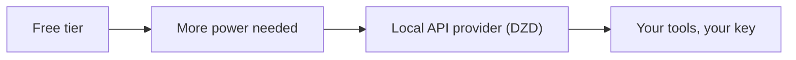

Algerian users searching for a "ChatGPT alternative" usually mean one of three things: the free tier is not enough, they cannot pay for Plus with a foreign card, or they need API access for their own applications. Each problem has a different answer.

This guide separates the three intents and explains what actually works in Algeria in 2026.

## Three different problems, three different answers

### 1. "ChatGPT free is not enough for my work"

If you want better models, more messages, and faster responses for personal use, the honest options are:

- **ChatGPT Plus (OpenAI)** requires a foreign card and USD billing. Friction for most Algerians.
- **Local AI providers with API access** let you pay in DZD for model access and use it through tools that speak the API.
- **Free alternatives** (Gemini free tier, Claude free tier, open models) work in browsers, but with usage limits and no API.

### 2. "I can't pay for Plus from Algeria"

The payment wall is the real problem. International subscriptions need foreign cards. Algerian alternatives:

- **AI providers that bill in DZD**, accepting CCP and Baridi Mob. You are not buying a "Plus subscription"; you are buying API access (an API key) with a monthly cap in dinars.
- **Prepaid international cards** are possible but costly and fragile.

### 3. "I'm building something: I need an API"

This is the developer case, and it is where "ChatGPT alternative" actually means **AI API provider**. You want:

- Programmatic access to GPT, Claude, Gemini, and open models
- One key, not five vendor accounts
- Predictable pricing: a monthly cap in DZD, not per-token USD bills
- Fallbacks when a model is down

## What a local AI provider gives you

Hawiyat is an AI infrastructure platform based in Algeria. Instead of selling subscriptions, it sells the **execution layer**: one API key that routes each task to the best model.

| Plan | Price | Notes |
|------|-------|-------|
| Pro | 6,000 DA/month | Solo builders, one key |
| MAX 5X | 15,000 DA/month | Heavy usage |
| MAX 20X | 30,000 DA/month | Teams and pipelines |

- Models are routes (GPT, Claude, Gemini, open), not separate subscriptions
- Billed in DZD, paid with **CCP or Baridi Mob**
- Every run evaluated; automatic fallbacks
- Support in Arabic, French, and English

See [the AI API in Algeria](/ai-api-algeria) and [pricing in DZD](/pricing). For a baseline on what the international subscription costs, OpenAI's [ChatGPT plans page](https://openai.com/chatgpt/pricing/) shows the USD pricing you would be paying with a foreign card.

## What to avoid

- **"Cheap ChatGPT subscriptions" on Facebook or Telegram.** Often shared accounts, revoked fast, and a security risk. Not the same as API access.
- **USD-pegged pricing.** If the price moves with the dollar, you are not really local.
- **Single-vendor lock-in.** A provider that only gives you one model is fragile. The execution layer should be model-agnostic.

## Frequently asked questions

**Is there a ChatGPT alternative in Algeria?** Yes. For API access, local providers like Hawiyat give you GPT, Claude, and Gemini behind one key, billed in DZD. For personal chat subscriptions, options are limited by foreign-card requirements.

**Can I use ChatGPT Plus in Algeria?** You can, if you have a foreign card and can pay in USD. Most Algerian users cannot, which is why local API providers exist.

**Is an AI API the same as ChatGPT?** No. An API lets your code call models. A subscription is a chat website. Different tools for different needs.

**What does a ChatGPT alternative cost in DZD?** Hawiyat Composer starts at 6,000 DA/month for API access with a monthly cap.

**Do I need a foreign card?** No. CCP and Baridi Mob are accepted.

Related: [AI providers in Algeria: how to choose](/blog/ai-providers-algeria-how-to-choose) and [the AI API cost guide](/blog/ai-api-algeria-costs).

---

*This article compares options in the Algerian market. ChatGPT is a trademark of OpenAI. Hawiyat is an independent provider and is not affiliated with OpenAI.*
