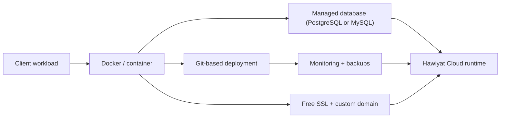

Most AI providers rent everything from a hyperscaler and pass the bill to you in dollars. Hawiyat runs its own infrastructure in Algeria, on hardware we consolidate and manage ourselves. This post explains what that infrastructure looks like, the migration that reshaped it, and what Hawiyat Cloud customers actually get.

## Why we run our own infrastructure

Running your own servers is more work. You own the failures, the disk space, the backups, and the 3 a.m. certificate renewals. We do it anyway because it buys three things that matter to Algerian customers: cost (no dollar-denominated hyperscaler margins), payment (billing in DZD with CCP or Baridi Mob is only possible when we control the stack), and latency (a workload served from Algeria does not cross continents for every request).

The infrastructure runs the whole business: the Composer execution layer, customer API keys, n8n instances, WhatsApp API infrastructure, and client workloads.

## The migration that changed everything

In 2026 we completed one of the largest infrastructure migrations in the company's history: hundreds of client workloads spread across multiple servers and data centers were consolidated onto a single server. The results:

- ~95% reduction in infrastructure costs
- ~150% increase in available capacity
- Zero data loss
- Zero downtime during cutover

The hardest part was not the cutover. It was the accumulated debt: forgotten services, certificate stores nobody wanted to touch, and Docker volumes that had been running in production for months without anyone fully tracking them. The migration forced us to inventory everything, and the inventory became the basis for how Hawiyat Cloud is structured today.

## What Hawiyat Cloud includes

Hawiyat Cloud is a managed runtime, quoted in DZD. You tell the team what you need to run, and the deployment is planned on containers, VPS, or Kubernetes:

- Managed containers, VPS, or Kubernetes, sized to your needs
- Managed PostgreSQL or MySQL database
- Free SSL certificate and custom domain support
- Automatic deployments from Git: push, and your changes go live
- Monitoring, uptime tracking, and backups
- Priority support via WhatsApp in Arabic, French, and English

There are no fixed tiers to outgrow. When your needs change, the deployment is re-sized to match - you only pay for what you actually use.

## How a deployment works

1. Contact the team and describe what you need to run.
2. We plan the setup: containers, VPS, or Kubernetes, with the databases and resources required.
3. You receive a quote in DZD, payable with CCP or Baridi Mob.
4. We deploy, provision the database, connect your domain with SSL, and hand over monitoring.

## DZD billing and local support

Because the infrastructure is ours, pricing is in Algerian dinars and support is local timezone. No foreign card, no currency conversion, no dollar-denominated invoice. Managed n8n hosting starts at 8,000 DA/year, and Composer plans start at 6,000 DA/month - see [Hawiyat Cloud on /pricing](/pricing) or [the product page](/services/hawiyat-cloud).

For reference on the container patterns we run, [Docker's deployment documentation](https://docs.docker.com/engine/install/) and [n8n's self-hosting docs](https://docs.n8n.io/hosting/) describe the same primitives we manage on behalf of clients.

Related reading:

- [How We Migrated Hundreds of Client Workloads Onto a Single Server](/blog/how-we-migrated-hundreds-of-client-workloads)
- [How Hawiyat Routes and Caches LLM Traffic in Production](/blog/how-hawiyat-routes-and-caches-llm-traffic)
- [What Is Hawiyat Composer?](/blog/what-is-hawiyat-composer)
- [n8n Hosting in Algeria: DZD Pricing, Setup, and What You Get](/blog/n8n-hosting-algeria-guide)

## Frequently asked questions

**What can I run on Hawiyat Cloud?** Websites, applications, full-stack projects, SaaS, and e-commerce sites. The team plans the deployment on containers, VPS, or Kubernetes, including a managed database when needed.

**Do I need a foreign credit card?** No. Hawiyat Cloud is billed in Algerian dinars and paid with CCP or Baridi Mob.

**How much does Hawiyat Cloud cost?** By order. You describe what you need, the team plans the deployment and sends a quote in DZD, so you pay for what you actually need.

**How do deployments work?** Automatic from Git. Connect your repository and every push deploys your changes, with free SSL and custom domain support.

---

*Third-party tool and model names are trademarks of their owners. Hawiyat is an independent provider and is not affiliated with or endorsed by them.*
