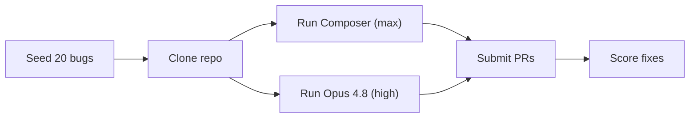

We benchmarked two AI agents against the same harness layer: Hawiyat Composer (max) and Claude Opus 4.8 (high). We used **Claude Code** as the orchestration tool that manages the benchmark environment and runs both agents.

Hawiyat Composer is a specialized AI agent for software engineering built by Hawiyat. Claude Opus 4.8 is Anthropic's flagship reasoning model. The two sit at very different price points and quota structures, so we wanted to see how they compare head-to-head on a real code audit task.

The full benchmark setup, prompt, and submission format are documented in [AGENTS.md](https://github.com/Hawiyat-Org/hawiyat-agents-benchmarks/blob/main/AGENTS.md).

## TL;DR

Both missed the exact same three bugs. Claude Opus 4.8 found two extra issues not in the original set. Hawiyat Composer fixed the broken build that Claude left untouched.

## Our setup

We built a full-stack TypeScript monorepo with 20 seeded bugs:

- **Frontend:** TanStack Start (React, TanStack Router, TanStack Query)
- **Backend:** Hono API server with Zod validation
- **Database:** Prisma ORM with SQLite
- **Monorepo:** pnpm workspaces + Turborepo

The bugs follow the established [SWE-bench pattern](https://github.com/SWE-bench/SWE-bench.git) and are distributed across difficulty levels. The bugs are not labeled. There are no TODO comments, no `BUG` markers. The agents had to find them the same way a human engineer would: by reading the code, running the tests, and noticing what does not make sense.

## How we ran the test

Each agent received the same prompt:

> _Clone this repo, follow AGENTS.md, and submit your fixes as a PR with your model name in the title._

Each run happened in its own isolated environment with no shared state. We tracked tokens, quota usage, wall-clock time, and bugs found.

For this benchmark, we ran Hawiyat Composer at **max** reasoning level, which activates its full routing pipeline and largest available context window. **Claude Opus 4.8** ran as a single model with no routing layer, at the **high** reasoning level. The single-model architecture is part of why it consumes more tokens and burns through daily quotas faster.

## Results

### Bugs found

Both agents found and correctly fixed the same core set: missing `await`, wrong status codes, TOCTOU races, middleware leaks, N+1 queries, missing transactions, unhandled promise rejections, and TanStack Query cache issues.

### The three bugs both missed

All three missed bugs share a common thread: they are not obvious from error messages or stack traces. They look like working code.

1. **N+1 in `posts.ts`.** The `/posts/:id/with-author` endpoint does a separate `findUnique` call for the author. This is the exact same pattern as the analytics N+1 that both agents found. They fixed one instance and missed the other because it appeared in a different endpoint context.
2. **`Promise.all` fail-fast in `dashboard.ts`.** The dashboard fetches users, posts, and benchmarks with `Promise.all`. If one fetch fails, the entire response crashes. Neither agent replaced it with `Promise.allSettled`.
3. **`undefined` filter in `users.ts`.** When no `email` query parameter is provided, the Prisma query `where: { email: undefined }` returns zero results instead of all users. A subtle framework-specific behavior both agents overlooked.

### Extra findings

Claude Opus 4.8 discovered two genuine bugs outside our planted set: the Hono RPC client had a double `/api` prefix causing 404s on all typed client calls, and `AppType` was not re-exported from the API package entry, breaking typed RPC routes.

Hawiyat Composer fixed pre-existing `tsconfig` issues that prevented `pnpm build` from passing. This was not one of our 20 bugs, but without it the benchmark was broken.

### Quota and time

Both agents finished in about an hour. Claude Opus 4.8 spent twice as much compute time thinking, but the wall-clock difference was only two minutes.

| Metric | Hawiyat Composer (max) | Claude Opus 4.8 (high) |
|--------|----------------------|------------------------|
| Bugs found (planted) | 16/20 | 17/20 |
| Extra findings | 0 | 2 |
| Build fixed | Yes | No |
| Quota used | 2.5% of monthly | 54% of daily |
| Wall-clock | ~1 hour | ~1 hour |

Hawiyat Composer used 2.5% of its monthly subscription for 16 bugs, roughly 33 full benchmark runs per month on a single plan. Claude Opus 4.8 used 54% of its daily quota for 17 bugs, roughly 2.5 full benchmark runs per day before hitting the cap.

The billing models are fundamentally different: a monthly subscription with a predictable ceiling versus daily usage limits that reset. Monthly subscriptions suit high-volume screening. Daily quotas work for individual deep audits.

## Convergent failure analysis

The most striking result is not the score difference. It is the overlap. Both agents missed the exact same three bugs. These three bugs represent failure modes that frontier models consistently struggle with:

- **Cross-file pattern transfer.** The N+1 in `posts.ts` is structurally identical to the one in `analytics.ts`. Both agents found the first instance and missed the second. The pattern did not transfer across file boundaries.
- **Defensive programming gaps.** `Promise.allSettled` instead of `Promise.all` is an engineering habit, not a bug fix. Neither model applied the defensive pattern unprompted.
- **Framework-specific knowledge.** Prisma's `undefined` filter behavior is a framework quirk that looks like correct code unless you know the gotcha.

The bugs they found break production loudly: crashes, timeouts, wrong status codes. The bugs they missed break production quietly: gradually degrading data quality and user experience over time.

## Limitations

This is one benchmark with one run per agent. We did not run statistical significance tests. The results are directional, not definitive.

Hawiyat Composer's 20 claimed fixes included changes that were not in our original 20 bugs. Whether this counts as over-claiming depends on whether you count only planted bugs or every fixable issue in the codebase. We scored only planted bugs.

Claude Opus 4.8's 54% daily quota consumption means a single benchmark run uses roughly half a day's allocation. Results will vary by plan tier and workload.

## Conclusion

The choice between these two agents depends on the job.

For high-volume screening or cost-sensitive work, **Hawiyat Composer at max** is the value pick. It found 16 of 20 bugs for 2.5% of a monthly subscription, finished in under an hour, and fixed the broken build that made the benchmark runnable in the first place.

For a single thorough pass, **Claude Opus 4.8 at high** produced the most complete report. It surfaced 17 of 20 original bugs plus two extra legitimate issues.

The broader finding is that the missed bugs are not model-specific. They are pattern-specific. Both agents failed on the same three categories: cross-file consistency, defensive programming, and framework edge cases. These are the kinds of problems that slip through any automated review, whether the reviewer is a frontier model or a human engineer working against a deadline.

The benchmark is open source. Clone it, run your own agent, and see what it misses.

## What this means for Composer users

This benchmark ran Composer at the **max** tier, which is part of the [MAX 5X and MAX 20X plans](/pricing) (15,000 and 30,000 DA/month, billed in DZD with CCP or Baridi Mob). At that tier, a full benchmark run cost 2.5% of the monthly quota. For solo builders, [Pro at 6,000 DA/month](/pricing) covers the same routing pipeline at lower capacity.

Composer is available as an [AI API in Algeria](/ai-api-algeria) and through the [execution layer](/composer). It is not a reseller of any model: Claude, GPT, Gemini, and open models are routes behind one key.

**Related links:**

- [PR #1: Hawiyat Composer results](https://github.com/Hawiyat-Org/hawiyat-agents-benchmarks/pull/1)
- [PR #2: Claude Opus 4.8 results](https://github.com/Hawiyat-Org/hawiyat-agents-benchmarks/pull/2)
- [Benchmark repository](https://github.com/Hawiyat-Org/hawiyat-agents-benchmarks)
- [Original Medium post](https://0xkatana.medium.com/we-audited-the-same-codebase-with-hawiyat-composer-and-claude-opus-4-8-0304295587d7)

---

*This benchmark is directional, not definitive: one run per agent, no statistical significance testing. Both agents are capable tools; the right choice depends on your workload.*

## Frequently asked questions

**Did Hawiyat Composer beat Claude Opus 4.8?** On cost efficiency, yes: 16 fixes for 2.5% of a monthly subscription. On raw bug count, Claude found 17 plus two extra findings. The results are directional, not definitive.

**What is the benchmark codebase?** A full-stack TypeScript monorepo with 20 seeded bugs, following the SWE-bench pattern. It is open source.

**Can I run the benchmark myself?** Yes. Clone the [benchmark repository](https://github.com/Hawiyat-Org/hawiyat-agents-benchmarks) and follow AGENTS.md.

**Which Composer plan covers this workload?** The max tier used here is on [MAX 5X or MAX 20X plans](/pricing), from 15,000 DA/month.
