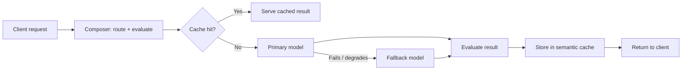

LLM API costs grow with every repeated request. An agent that re-asks the same question, a pipeline that re-processes the same context, a workflow that hits the same prompt every hour: each one spends the same tokens again. This post explains how the Hawiyat gateway attacks that problem with model routing, semantic caching, and fallback chains - and what the numbers look like in production.

## The problem: agents repeat themselves

When you call an LLM API directly, every request is billed as if it were new. Most tools that run on top of LLMs are built around repetition: a Claude Code session re-sends context, an n8n workflow polls a prompt on a schedule, an autonomous agent retries a task. From the API provider's perspective each of those is fresh revenue. From the customer's perspective it is the same work paid for twice.

The gateway exists to sit between the tool and the model, so it can see what the model cannot: which requests are actually new.

## The design: three layers

The Hawiyat gateway is a stateful, context-aware abstraction layer between client tools and upstream LLM providers. Three mechanisms matter most for cost:

**Routing.** Each request is analyzed and assigned to a model family by the Composer execution layer, which weighs quality, latency, and cost per task. The same API key reaches GPT, Claude, Gemini, and open models; the gateway decides which one handles a given task.

**Semantic caching.** When a request arrives, the gateway checks whether an equivalent request has been answered recently. The cache key is semantic, not literal: two prompts that mean the same thing can share a cached completion. Cache hits cost a fraction of a full model call.

**Fallback chains.** When a primary model fails or degrades, the gateway retries on the next model in the chain without the client ever seeing an error. The client does not need to implement retries; the infrastructure handles it.

## What the numbers look like

In one production week (August 21-27, 2026) the gateway handled **46,931 requests and 3.02 billion tokens**. A single day accounted for roughly 56% of that week's volume - traffic is spiky, and the infrastructure is sized for the spikes, not the average.

Cache behavior is not uniform across model families. Our best-hit family served **98% of its requests from cache** (26,400+ requests in that week), which is the difference between an expensive workload and a cheap one. Other families sat near 0% cache because their usage patterns are dominated by unique, one-off prompts. The lesson: cache-hit rate is a property of the workload, not the infrastructure. Repeated, structured workloads cache well; fresh conversational prompts do not.

## Why LLM caching is hard

Exact-match caching on LLM traffic is nearly useless. Real workloads rephrase, reorder, and add context. A literal string hash catches almost nothing. The hard part is deciding what counts as "the same question" - and getting that wrong is worse than not caching at all, because a bad cache hit serves a wrong answer confidently.

The gateway's semantic cache solves this by hashing on meaning rather than text, and by keeping cached results short-lived so stale completions cannot leak into production. Combined with the evaluation step that scores every result, a cached answer is not just cheap, it is a previously verified answer.

This is the same architectural pattern that large-scale infrastructure teams document publicly - Cloudflare's engineering blog on [caching and memory optimization](https://blog.cloudflare.com/dns-cache-memory-optimization-1111/) is a good reference for how much work goes into making cache decisions fast and correct, and [Docker's documentation on container networking](https://docs.docker.com/engine/network/) covers the runtime layer these workloads sit on.

## What this means for customers

This is the engineering behind the flat DZD pricing. A Composer plan or LLM credits balance does not depend on how many upstream providers you touch; it depends on what the gateway actually spends, and caching is what keeps that spend sane. Customers who run structured workloads - automation, agents, scheduled jobs - benefit the most. Plans start at 6,000 DA/month on the [pricing page](/pricing), and prepaid [LLM credits](/credits) start at 2,000 DA with no subscription.

- [LLM credits: buy any amount in DZD](/credits)
- [Composer plans on /pricing](/pricing)
- [What Is Hawiyat Composer?](/blog/what-is-hawiyat-composer)
- [How We Migrated Hundreds of Client Workloads](/blog/how-we-migrated-hundreds-of-client-workloads)

## Frequently asked questions

**Does Hawiyat cache my data?** Cached completions are stored only long enough to serve repeated requests and are never used to train models. Your prompts and results are not used to improve any third-party model.

**Which models does the gateway route to?** One API key reaches GPT, Claude, Gemini, and open models. The Composer layer picks the best model for each task, with automatic fallbacks on failure.

**How is traffic billed in DZD?** Through Composer plans or prepaid LLM credits, both billed in Algerian dinars and payable with CCP or Baridi Mob. No foreign card needed.

---

*Third-party tool and model names (Claude, ChatGPT, GPT, Gemini) are trademarks of their owners. Hawiyat is an independent provider and is not affiliated with or endorsed by them.*
