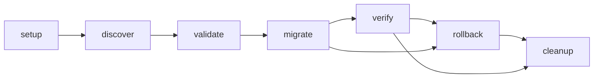

A few weeks ago, we completed one of the largest infrastructure migrations we have ever attempted at Hawiyat. We consolidated an infrastructure previously spread across multiple servers and data centers, containing hundreds of client workloads, onto a single server.

The final numbers looked almost unrealistic:

- ~95% reduction in infrastructure costs
- ~150% increase in available capacity
- Zero data loss
- Zero downtime during cutover

The interesting part is that the migration itself was not the hardest challenge. The hardest part was dealing with months of accumulated infrastructure decisions, forgotten services, certificate stores no one wanted to touch, and Docker volumes that had been quietly living in production without anyone fully tracking them anymore.

In this post, we walk through the architecture, automation layer, migration engine, edge cases, and the decisions that made this possible.


## The starting point

Like most infrastructure systems, ours evolved organically over time as new clients and requirements were added. The majority of workloads were n8n-based automation environments, but the platform also supported full-stack web applications, Chatwoot instances, WordPress deployments, monitoring stacks, AI services, and internal tools.

Whenever a new requirement appeared, provisioning a new server was often the fastest solution. Over time, we reached a point where spinning up new infrastructure became easier than understanding what already existed. That was the clear signal that simplification was overdue.

Each server effectively became its own isolated environment, with its own Traefik instance, Let's Encrypt certificates, PostgreSQL setup, Redis configuration, and Docker Compose stacks. The workload distribution looked roughly like this:

- ~90% n8n automation instances
- ~10% everything else (Chatwoot, WordPress, internal tools, and more)

The cost was no longer just financial. It was operational and cognitive. We knew consolidation was necessary. The only real question was whether it could be done safely, without downtime.

## The architecture that made this possible

The entire system relied on a standardized deployment layer we built internally. Its purpose was to ensure every service followed predictable patterns for structure, networking, and deployment.

Every project followed the same filesystem layout:

```text
/etc/hawiyat/compose/{project-id}/
├── code/
│   ├── docker-compose.yml
│   └── .env
└── files/
    └── app/config.yaml
```

This strict structure allowed the automation layer to reliably locate everything regardless of server, client, or service type.

### Networking standardization

Each project had its own Docker network while sharing a central routing network used by Traefik. This ensured strong isolation while maintaining a single unified entry point.

### Deterministic container naming

Every container followed a predictable pattern: `{project-id}-{service-name}-1`. This made container discovery fully programmatic instead of heuristic, which is essential when managing hundreds of services across multiple machines.

### Traefik label consistency

All services used consistent Traefik labels. This allowed us to extract routing rules and domain mappings directly from Docker metadata without relying on external registries or manual configuration. From these labels, we could reconstruct the entire public-facing surface of the infrastructure, every domain, route, and TLS configuration, directly from the running system.

### Internal deployment control plane

On top of this, we built an internal deployment layer that exposed programmatic control over applications, compose stacks, databases, and supporting services. This effectively became a single control plane for the entire infrastructure, replacing what would otherwise have been manual server-by-server operations.

## The migration engine

We built a TypeScript orchestration framework that became the core system responsible for coordinating the entire migration lifecycle. It acted as a control loop over hundreds of distributed systems, turning what is normally manual infrastructure work into a deterministic pipeline.

At a high level, every migration followed this state machine:



The core principle was simple: every step had to be independently verifiable and safely retryable. Nothing was assumed successful unless explicitly proven.

### Setup

The target server was prepared and validated for consistency: Docker runtime, networking prerequisites, and the shared routing layer used by Traefik. This ensured a predictable baseline environment before workloads were moved.

### Discovery

Each source server was scanned remotely over SSH to reconstruct a full runtime snapshot: containers, volumes, networks, environment variables, mounted configs, and Traefik labels. This data was normalized into a structured representation used throughout the migration process.

### Integrity validation

Before any data transfer, a recursive SHA-256 hash was computed across all relevant files in all volumes. After transfer, the same hash was recomputed on the destination. Any mismatch immediately aborted that migration. This provided a strict guarantee against silent corruption.

### Data transfer

Data movement was intentionally simple: volumes were streamed using `rsync` directly from source to destination. This kept the system predictable and stateless even with large datasets.

### Reconstruction

Once data was transferred, each project was rebuilt on the target machine: restoring Docker Compose definitions, recreating networks, attaching services to the shared routing layer, and re-enabling Traefik routing.

### Verification

Each workload type had its own health validation strategy: database readiness checks for PostgreSQL, ping checks for Redis, HTTP probes for web services, and container-level checks for edge cases. Only after all checks passed was a migration considered complete.

### State management

The engine maintained persistent state for every project. This allowed migrations to be paused, retried, or resumed safely without risking duplication or corruption. In practice, this turned infrastructure migration from a fragile one-time operation into a controlled, repeatable process.

## Where automation stops working

Not everything could be fully automated, and that was expected from the beginning.

Roughly 90% of workloads were identical n8n instances. These followed a strict and predictable structure: same image, same database type, same volume layout, and consistent runtime assumptions. This made them ideal for full automation, and the migration engine handled them end-to-end without human intervention.

The remaining 10% were fundamentally different. These included systems such as Evolution API, WordPress, custom web applications, OTP services, monitoring tools, and Ollama deployments. Differences in storage layout, database engines, service coupling, or filesystem ownership made full generalization risky. For these, building a universal automation layer would have been more expensive than handling them directly.

Instead, we used structured runbooks for each system. These were not informal checklists but deterministic procedures including migration steps, rollback strategies, validation checks, and DNS cutover logic. The goal was to make even manual migrations reproducible and safe.

### Batch execution strategy

To manage scale, migrations were executed in controlled batches. Each batch had strict concurrency limits to avoid overwhelming either the source or target system. Between batches, deliberate delays were introduced to allow state convergence, DNS propagation, and system stabilization.

### Resumable migrations

The orchestration engine tracked persistent state for every project. Migrations were fully resumable: any failure could be retried later from the exact step where it stopped.

This combination of automation (~90%), structured runbooks (~10%), and controlled batching created a system that was both scalable and safe.

## Results

- ~95% reduction in infrastructure costs
- ~150% increase in available capacity
- Zero data loss
- Zero downtime during cutover
- ~90% fully automated migrations
- ~10% handled via structured runbooks

## Final thoughts

What initially looked like a straightforward consolidation on paper became weeks of careful engineering, validation, and controlled execution. The standardization layer made automation possible. The automation layer made scale safe. The runbooks handled everything that refused to fit the model.

Today, a single server handles what previously required an entire fleet. More importantly, the system is now simpler than it was before the migration began.

This is the infrastructure behind [managed n8n hosting in Algeria](/services/n8n-hosting) (from 8,000 DA/year, paid with CCP or Baridi Mob) and [Hawiyat Cloud](/services/hawiyat-cloud). It is also why Composer plans are priced in DZD: our costs dropped ~95%, and we pass that to customers. The original write-up is on [Medium](https://medium.com/@0xA1M/how-we-migrated-hundreds-of-client-workloads-onto-a-single-server-without-downtime-783ec0a336dc).

## Frequently asked questions

**Was any client data lost during the migration?** No. Zero data loss, guaranteed by recursive SHA-256 hash validation before and after every transfer.

**How long did the migration take?** Weeks of engineering, with migrations executed in controlled batches to allow state convergence and DNS propagation.

**What percentage was automated?** Roughly 90% of workloads (identical n8n instances) were fully automated; the remaining 10% used structured runbooks.

**Does Hawiyat manage n8n instances this way?** Yes. This is the same standardized layer behind our [managed n8n hosting](/services/n8n-hosting).

---

*Originally published on [Medium](https://medium.com/@0xA1M/how-we-migrated-hundreds-of-client-workloads-onto-a-single-server-without-downtime-783ec0a336dc). Republished with permission.*
