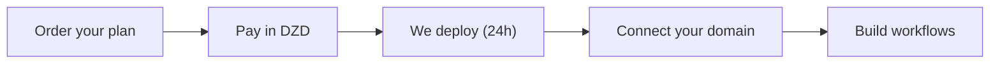

n8n is one of the most popular workflow automation tools in the world. In Algeria, it is becoming the default choice for businesses automating WhatsApp, CRM, and AI pipelines. The problem: hosting n8n properly (server, updates, SSL, uptime) is real work, and most international hosting providers bill in USD.

This guide covers what managed n8n hosting in Algeria looks like, what it costs in DZD, and what you actually get.

## What is n8n?

[n8n](https://n8n.io/) is an open-source workflow automation platform. You connect apps (WhatsApp, Google Sheets, CRMs, databases, AI models) and build automated workflows with a visual editor or code nodes.

Common Algerian use cases:

- Automating WhatsApp replies and notifications
- Connecting a CRM to form submissions
- Building AI pipelines that call GPT or Claude
- Scheduled tasks (reports, backups, data sync)
- Webhook endpoints for external systems

## Why hosting matters

You can run n8n yourself on a VPS, but then you own:

- Server setup and security patches
- SSL certificates
- Database management (n8n uses PostgreSQL)
- Backups and disaster recovery
- Monitoring and uptime

For a business, that is a full-time job. **Managed hosting** removes all of it: the provider runs the infrastructure, you build the workflows.

## Managed n8n hosting in Algeria: pricing in DZD

Hawiyat offers managed n8n hosting with plans priced in Algerian dinars:

| Plan | Price | Includes |
|------|-------|----------|
| Freelance | 8,000 DA/year | Up to 8 concurrent workflows, PostgreSQL, custom domain, webhooks |
| Startup | 30,000 DA/year | Worker-based setup, unlimited executions, unlimited workflows |
| Enterprise | 80,000 DA/year | Automatic backups, 99.9% uptime SLA, WhatsApp support |

Every plan includes:

- Latest n8n version with all core nodes
- SSL certificates
- 24/7 monitoring
- PostgreSQL database
- Custom domain support
- Webhook endpoints for external integrations
- Support in Arabic, French, and English

Payment: **CCP, Baridi Mob, or USD**. No foreign card needed.

See the [n8n hosting service page](/services/n8n-hosting) and [full pricing in DZD](/pricing).

## How deployment works

1. **Order your plan** on the n8n hosting page with your preferred payment method.
2. **Pay** in dinars (CCP or Baridi Mob).
3. **We deploy.** Your instance is ready within 24 hours with SSL, updates, and monitoring enabled.
4. **You connect.** Custom domain, webhooks, and your first workflow.

Pair it with an AI API for a full stack: read [AI for business in Algeria](/blog/ai-business-algeria-production) or the [AI API cost guide](/blog/ai-api-algeria-costs).

## n8n + AI: the Algeria advantage

The most powerful pattern in Algeria right now is n8n plus an AI API. A workflow triggers on a WhatsApp message, calls GPT or Claude through an API key, and replies automatically, all running on local infrastructure, billed in DZD.

You can pair managed n8n hosting with a [Composer AI API plan](/ai-api-algeria) for a fully local AI automation stack. The n8n community has extensive [documentation](https://docs.n8n.io/) on building these pipelines.

## What the migration numbers say

We recently consolidated hundreds of client workloads (most of them n8n-based) onto a single server with zero downtime and roughly 95% lower infrastructure cost. The engineering write-up is on [Medium](https://medium.com/@0xA1M/how-we-migrated-hundreds-of-client-workloads-onto-a-single-server-without-downtime-783ec0a336dc). That is the infrastructure your n8n instance runs on.

## Frequently asked questions

**Do I need a foreign card for n8n hosting in Algeria?** No. Hawiyat accepts CCP and Baridi Mob, billed in DZD.

**Is n8n hosting expensive in Algeria?** Freelance starts at 8,000 DA/year, less than many VPS plus maintenance setups, with support included.

**Can I use my own domain?** Yes, every plan includes custom domain support.

**What happens if my workflow breaks?** Monitoring is 24/7; Enterprise adds a 99.9% uptime SLA with compensation and WhatsApp support.

**Can I upgrade plans later?** Yes, from Freelance to Startup or Enterprise at any time, without downtime.

---

*This article explains managed n8n hosting in Algeria. n8n is an open-source project; Hawiyat is an independent hosting provider.*
