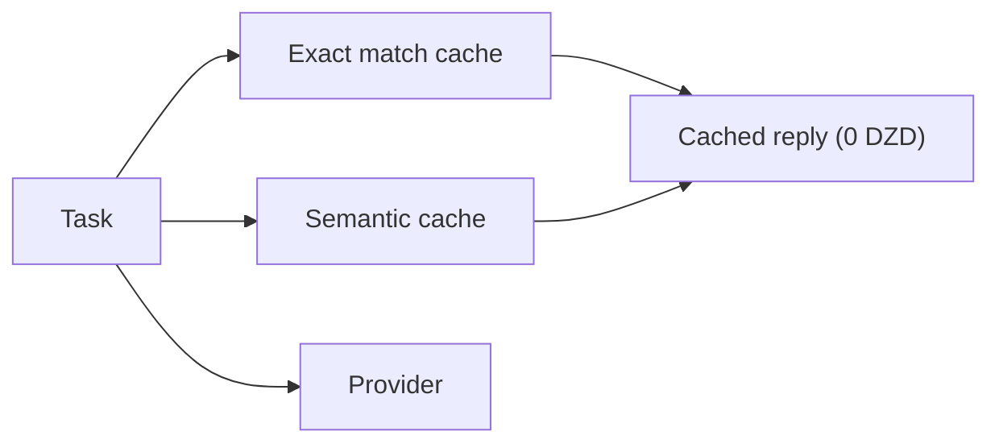

Hawiyat Composer is a highly optimized, stateful, and context-aware abstraction gateway that sits between user clients (CLIs, autonomous agents, code completion extensions) and upstream LLM providers.

Think of it as an intelligent proxy layer. Instead of your developer tools talking directly to OpenAI or Anthropic, they talk to Hawiyat Composer. The gateway exposes downstream APIs that identically mimic standard OpenAI and Anthropic endpoint structures, which lets it act as an immediate drop-in replacement for tools like Claude Code or standard Copilot extensions without modifying a single line of their source code.

## Why we built it

We engineered this gateway out of stark operational necessity, to solve three systemic bottlenecks:

1. **Prohibitive API expenses.** The operational cost of continuous microservice development via direct provider endpoints was draining our budget. We needed a way to eliminate paying for the exact same data over and over again.
2. **Context inefficiency.** Advanced developer agents work by reading your entire codebase layout on every single turn. Sending 100,000 tokens back and forth for a simple one-line code change is structurally broken.
3. **The absence of optimization layers.** Standard API integrations lack intermediate abstraction: no client-side caching mechanisms, no centralized systems to handle structural context. That forces remote providers to handle expensive repetitive calculations.

## What it is used for

Hawiyat Composer manages, optimizes, and secures enterprise AI workflows through three core functionalities.

### 1. Multi-tiered cost mitigation (smart caching)

The gateway intercepts outgoing requests to stop token waste before it hits your wallet:

- **Exact match caching.** For repetitive tasks like boilerplate testing, the gateway normalizes the payload, checks an in-memory Redis database, and serves the answer instantly in 2 to 5 milliseconds, bypassing the AI provider entirely for a cost of exactly 0 DZD.
- **Semantic caching.** If a developer asks the same question in a slightly different way, the gateway uses vector search to recognize the underlying meaning and serves the historical answer locally.
- **Provider-side caching.** When a request must go to the provider, the gateway reorganizes the prompt structure, putting static system rules at the top and highly volatile user messages at the absolute end. It then forces the provider's hardware to cache the heavy code context, triggering massive financial discounts on subsequent requests.

### 2. Algorithmic smart routing and chaos resolution

The gateway acts as an automated traffic controller. It tracks network response times and automatically routes basic tasks to lightweight, cheaper models, saving elite frontier models for highly complex logic.

During complex multi-agent execution loops, standard routing algorithms get confused because agent communications look nearly identical. Hawiyat Composer integrates advanced reasoning engines to decompress ambiguous prompts, map out hidden microservice dependencies, and cleanly delegate the workflow to the perfect downstream endpoint.

### 3. Enterprise data privacy and compliance

For corporate environments, data leaks are a legal nightmare, so Hawiyat Composer serves as a hybrid compliance layer:

- **Local data protection.** When a request involves sensitive internal parameters or proprietary code, the gateway transparently routes the task to secure self-hosted on-premise models.
- **Safe frontier access.** If the task is non-sensitive, it routes outward to elite public models.
- **Zero-knowledge architecture.** The platform operates via unique cryptographic hash tokens instead of email registrations, enforcing a strict zero-logging policy.

## How it fits your stack

Composer is the engine inside Hawiyat's [execution layer](/composer). You access it with one API key, billed in DZD with [CCP or Baridi Mob](/pricing), and it routes every task across GPT, Claude, Gemini, and open models. See the [AI API in Algeria](/ai-api-algeria) page for how to start.

## Frequently asked questions

**Is Hawiyat Composer a ChatGPT alternative?** No. It is an execution layer and API gateway for developers building their own tools. It is not a chat subscription.

**What models does Composer route to?** GPT, Claude, Gemini, and open models. Models are routes on the execution layer, never resold subscriptions.

**How much does it cost?** Pro is 6,000 DA/month, MAX 5X is 15,000 DA/month, MAX 20X is 30,000 DA/month, billed in DZD.

**Can I use it with Claude Code?** Yes. The gateway mimics standard OpenAI and Anthropic endpoint structures, so Claude Code and Copilot extensions connect without source changes.

**Do I need a foreign card?** No. CCP and Baridi Mob are accepted.

Read the deep dive on the [Composer execution engine](/composer) or the [benchmark of Composer vs Claude Opus 4.8](/blog/hawiyat-composer-vs-claude-opus-benchmark).

---

*Originally published on [Medium](https://medium.com/@b_bouabca/what-is-hawiyat-composer-f4090fb12f13). Republished with permission.*
